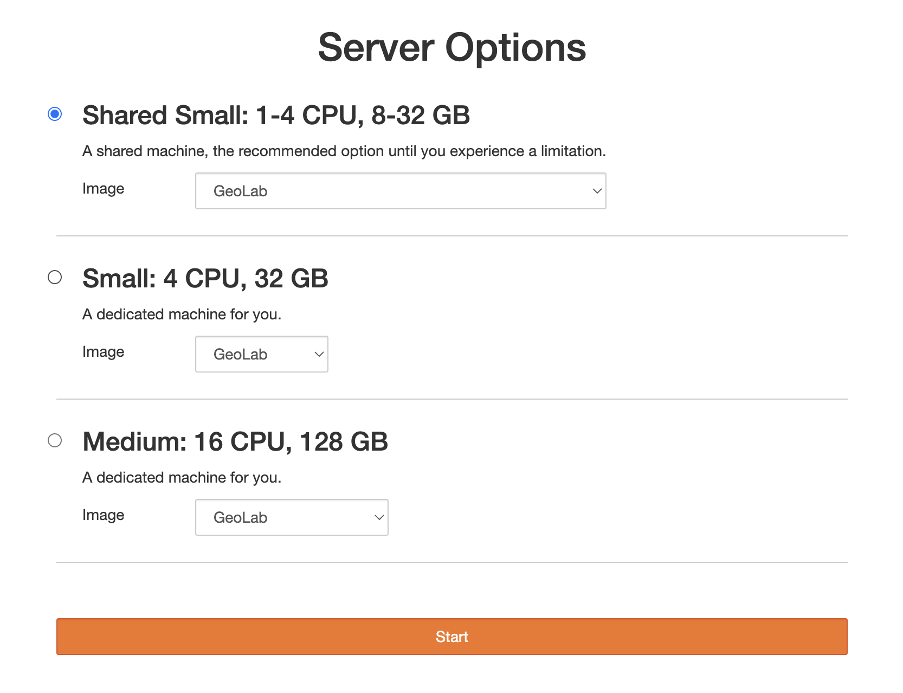
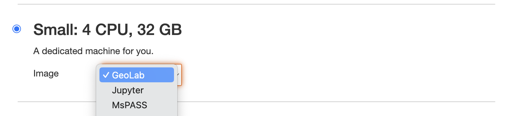
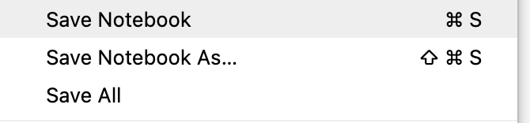
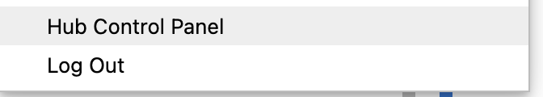

# Getting Started: GeoLab - test build

 

## 1. Registration & User Profile

Visit our [EarthScope User Management account page](https://www.earthscope.org/data/authentication/) to sign up and/or view your existing user profile.


## 2. Getting an approved Earthscope Profile

Once you get an Earthscope-approved profile, you can sign on through the [Jupyterhub portal](https://geolab.earthscope.cloud/hub/login?next=%2Fhub%2F).
 The portal will take you to a sign-on page, asking you to sign in with your email or a Google address.


 

## 3. Launching your server 
The Choose Your Server option lets you select a computing environment tailored to your needs, ensuring you have the right resources for your projects. 



When selecting a server for your JupyterHub environment, it's important to choose one that meets your computational needs without overcommitting resources. Below are the available server options along with their specifications and recommended use cases.


The **Shared Small server** is a multi-user environment where resources are shared among several users. This is the recommended option for most users, especially for those starting out or working on less intensive tasks. 
Use Cases
  - Initial development and testing
  - Educational purposes
  - Light to moderate data analysis

The **Small server** is a dedicated environment with more robust resources. This option is suitable for users who need more computational power and memory for their projects. It ensures that you have consistent access to the allocated resources without competition from other users.
Use Cases
  - More intensive data analysis and processing
  - Running medium-sized machine learning models
  - Projects requiring higher memory capacity

The **Medium server** provides a balanced environment with significant computational power and memory, making it ideal for more demanding tasks. This option is perfect for users who require a substantial amount of resources for their work but do not need the highest available tier.

  - Large-scale data analysis and processing
  - Running large machine learning models and simulations
  - Projects involving substantial datasets and computational workloads

**To request a larger server, please contact an administrator**


## 4. Selecting your image

In JupyterHub, selecting the appropriate image is crucial for ensuring you have the necessary tools and libraries for your tasks. Geolab is currently set up with 2 default images, **GeoLab** and **MsPASS**.

- **GeoLab:** This image is designed for students and researchers. It includes pre-installed tools and libraries commonly used in geophysical studies.

- **MsPASS:** This curated image is specifically prepared for the MsPASS short course.

- **Custom Images:** Custom images can be created upon request. If you have specific requirements or need particular software setups, please get in touch with the administration to discuss your needs and have a custom image prepared for you.



After selecting your appropriate image, you will be prompted with a loading screen. Please be aware that this process may take a few minutes.


Once the loading process is complete, you will be prompted with a Jupyter Notebook interface. If you encounter any issues, double-check that you have selected the correct image. If problems persist, please contact an administrator for assistance.

Run this code to check if you are in the right image:

 **Check image:** 
  ```python
  !printenv | grep IMAGE
  ```
If on the wrong image skip to step 5 to restart and select the correct image 

## 5. Once in Hub

Once you are in the JupyterHub environment, take some time to familiarize yourself with the interface and available tools. Here are a few steps to get you started:

**Explore the Environment:**
- Spend a few minutes navigating through the JupyterHub interface to understand where different features and options are located.

**Check Out the /shared Drive:**
- The /shared drive contains additional documentation and introductory notebooks that can help you get up to speed with the tools and workflows available in JupyterHub.
- Review these resources to enhance your understanding and make the most out of your JupyterHub experience.

**Respect the Hub:**
- Be mindful of the resources you are using and ensure you are not overloading the system.
- Properly shut down your server when you are done to conserve resources and maintain system efficiency.


## 6. When you finish

When you have finished your work, it is important to properly shut down your server. This helps to conserve resources and maintain system efficiency. To shut down the server:

### Save all your work in the Jupyter Notebook



### Navigate to the Control Panel



### Click on the "Stop My Server" button


# Happy computing & Enjoy your time in GeoLab!


```python

```
