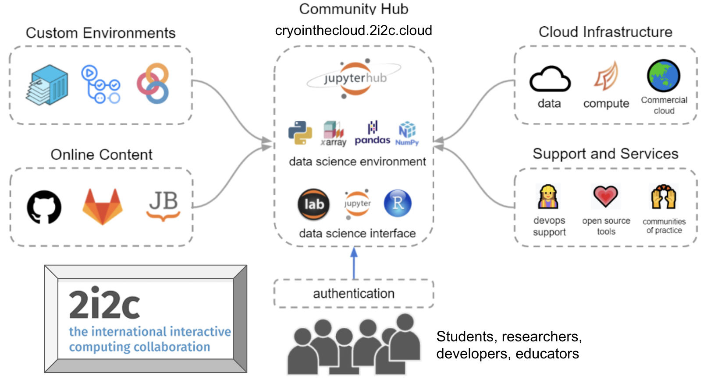

# About

The nature of scientific collaboration and outreach is changing right in front of us, in ways that continue to astonish and inspire us. The ways in which research is conducted, data is collected, and results are communicated to public and private stakeholders are rapidly evolving from isolated, privileged institutions to distributed networks of communities with individual members that move dynamically from one group to another. With GeoLab, we seek to leverage that new, contemporary structure to make the practice of geophysical science more transparent, productive, repeatable, and inclusive.

EDIT FROM HERE -----
``Communities such as Project Jupyter and Pangeo have pioneered a model for the inclusive, interconnected, and data-intensive practices of the future through cloud-based JupyterHub workflows. However, substantial barriers exist for individual users to make the transition from their local systems to the cloud to accomplish research goals: cloud cost opacity, infrastructure deployment complexity, and a general lack of community awareness and knowledge, among others. We can overcome these barriers by building upon existing cloud-workflow models and creating infrastructure that allows researchers to seamlessly move their workflows wherever they can do their best work.

To optimize and expand this cloud-based model, CryoCloud is a NASA-funded project for a managed computing platform. The cloud environment is adapted to the current needs of researchers, provides cloud and community expert-led hackathon-style training workshops, and works towards development of new open-source tools for collaborative, open-science research. This cycle of interconnected practice, research, and development helps us better understand the evolving needs of researchers working in this manner, and thus adapt our tools to facilitate the growth of multi-community infrastructure.
``
-----TO HERE

Our community cloud-based ecosystem is based on a partnership between organizers comprised of EarthScope staff members, the NSF GAGE/SAGE community, and the [International Interactive Computing Collaboration (2i2c) team](https://2i2c.org). Together, we foster communication around the development of cloud-based workflows, create content that guides users towards leveraging open-source tools and software, and builds infrastructure that is consistent with best practices and standards.

