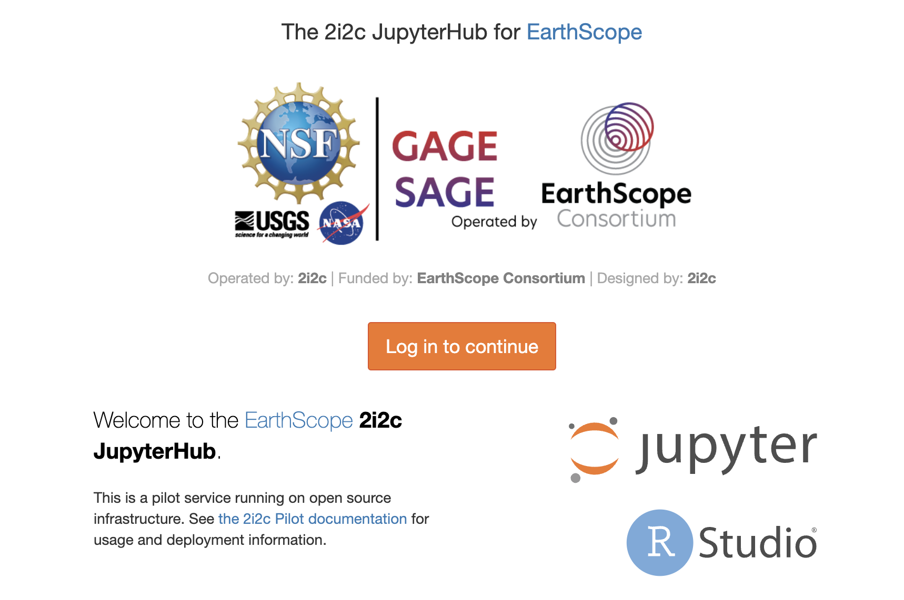
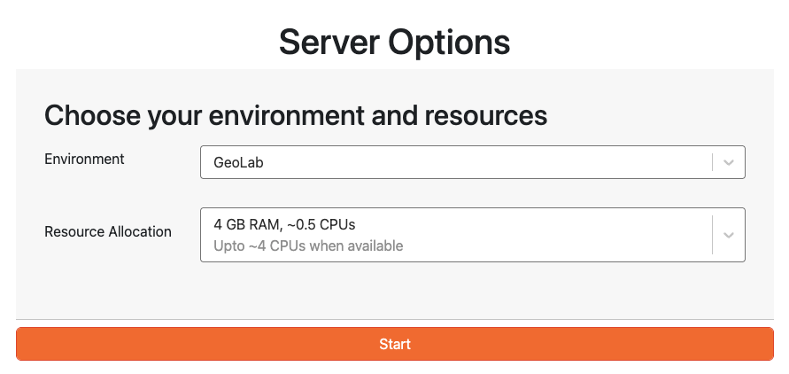

# Start Here


# Registration & Access

Welcome to GeoLab! The EarthScope-operated JupyterHub provides a powerful platform for accessing Jupyter Notebooks in a shared, cloud-based environment. GeoLab is a collaborative environment for students, researchers, and other members of the geoscience community to work on high-throughput, data-intensive workflows by providing access to powerful computational resources, tools, and a community of experts.

Most users will join GeoLab through one of the EarthScope Short Courses or other specific hosted workshops. However, if you have come across GeoLab through some other way and are part of the geophysics or other Earth science communities and want to join GeoLab, please follow the instructions below, which will guide you through the onboarding process and help you gain access to GeoLab.

## 1. EarthScope User Account

To be approved for access to GeoLab, you'll need to follow a few steps.

First, you'll need to register for an EarthScope User account. Visit our [EarthScope User Management account page](https://www.earthscope.org/user/) to sign up and/or view your existing User profile. Detailed instructions to create an account can be found at the following link: [ES User account creation](../content/how_do_i/register_es_user.md)

## 2. GeoLab Access Form

Second, please fill out this short Requesting GeoLab Access form to provide us with the necessary credentials and information to grant you access to the hub.

For more detailed instructions on this step, please refer to [here](../content/how_do_i/register_geolab_access.md).

## 3. Getting an approved Earthscope Profile
Once you get an Earthscope-approved profile, you can sign on through the [Jupyterhub portal](https://geolab.earthscope.cloud/hub/login?next=%2Fhub%2F).
The portal will direct you to a sign-on page, where you will be asked to sign in with your email address or a Google account.


## 4. Launching your server
The Choose Your Server option allows you to select a computing environment tailored to your specific needs, ensuring you have the right resources for your projects.

It is important to select a server for your JupyterHub environment that meets your computational needs without overcommitting resources. Below are the available server options, along with their specifications and recommended use cases.


The **Shared Small server** is a multi-user environment where several users share resources. This environment is recommended for most users, especially those new to the platform or working on less intensive tasks.
Use Cases
  - Initial development and testing
  - Educational purposes
  - Light to moderate data analysis

The **Small server** is a dedicated environment with more robust resources. This option is suitable for users who require more computational power and memory for their projects. It ensures consistent access to the allocated resources without competition from other users.
Use Cases
  - More intensive data analysis and processing
  - Running medium-sized machine learning models
  - Projects requiring higher memory capacity

The **Medium server** offers a balanced environment with substantial computational power and memory, making it well-suited for more demanding tasks. This option is perfect for users who require substantial resources for their work but do not need the highest available tier.

  - Large-scale data analysis and processing
  - Running large machine-learning models and simulations
  - Projects involving substantial datasets and computational workloads

**To request a larger server, please contact an administrator**

## 4. Selecting your image
In JupyterHub, selecting the appropriate image is crucial to ensuring you have the necessary tools and libraries for your tasks. Geolab is currently set up with two default images: **GeoLab** and **MsPASS**.

- **GeoLab:** This image is designed for students and researchers. It includes pre-installed tools and libraries commonly used in geophysical studies.

- **MsPASS:** This curated image is specifically prepared for the MsPASS short course.

- **Custom Images:** Custom images can be created upon request. If you have specific requirements or need a particular software setup, please contact the administration to discuss your needs and have a custom image prepared for you.

After you select your appropriate image, GeoLab will display a loading screen. This process may take a few minutes to complete.

Once the loading process is complete, the Jupyter Notebook interface is displayed. If you encounter any issues, double-check that you have selected the correct image. If problems persist, please contact an administrator for assistance.
Open a Terminal and run this code to check if you are in the right image:

 **Check image:**
 ```
 printenv | grep IMAGE
 ```
If on the wrong image, skip to step 5 to restart and select the correct image
## 5. Once in Hub
Once you are in the JupyterHub environment, take a moment to familiarize yourself with the interface and the available tools. Here are a few steps to get you started:

**Explore the Environment:**
- Spend a few minutes navigating through the JupyterHub interface to understand where different features and options are located.

**Check Out the /shared Drive:**
- The /shared drive contains additional documentation and introductory notebooks that can help you get up to speed with the tools and workflows available in JupyterHub. Review these resources to enhance your understanding and maximize your JupyterHub experience.

**Respect the Hub:**
- Be mindful of the resources you are using and ensure you are not overloading the system.
- Properly shut down your server after completing your session to conserve resources and maintain system efficiency.

## 6. When you finish
When you have finished your work, shutting down your server properly is important. Shutting down the server helps to conserve resources and maintain system efficiency. To shut down the server:
### Save all your work in the Jupyter Notebook

### Navigate to the Control Panel

### Click on the "Stop My Server" button

# Happy computing & Enjoy your time in GeoLab!