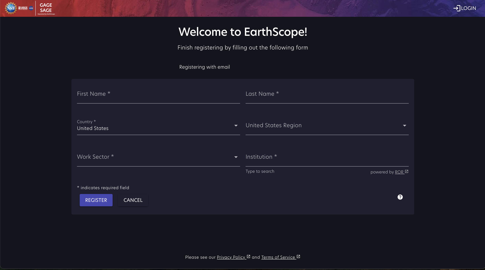

# Register an EarthScope User account

To gain access to GeoLab, register for an EarthScope User account.

To begin the registration process, click the following link: https://earthscope.org/user 

Register a new User account by selecting "Continue with Google" or "Continue with Cilogon". If you do not have a Google or CiLogon account associated with the email used to register, select "Don't have an account? Sign Up."

Either option displays a page with the required fields: First Name, Last Name, Country, Work Sector, and Institution.

If your institution is not listed in the pull-down menu, type the full name of your institution from the[Research Organization Registry](https://ror.org/) and select 'Save'. If you are not currently affiliated with a research or education institution, type "none" and select "Save."

Select "Register" to complete registration. Account details are available on the [User homepage](https://www.earthscope.org/user/info), where you can manage credentials for API access and real-time GNSS licenses.