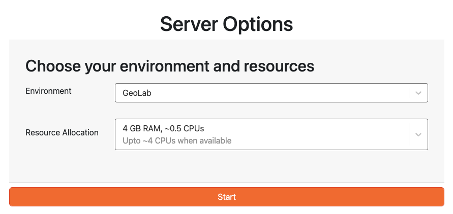

# Launching your Server
GeoLab offers several cloud server configurations. Use the menu options on this page to select your environment and resource configurations.



## Select an Environment
Several pre-configured compute environments are available to choose from. Use the dropdowns below to select your initial configuration. Please see [Envrionment Management](../advanced_topics/env_mgmt.md) for more details on customizing your ephemeral server instance after launch, or bringing your own custom image.

```{dropdown} GeoLab
The default GeoLab image contains a variety of python packages to enable a broad range of geophyiscal data analysis.
This image inherits all software in pangeo/pytorch_notebook, and includes additional support for EarthScope SDK/CLI and other geophysics tools. For a complete list of packages included in this image, see the GeoLab [github](https://github.com/EarthScope/GeoLab/tree/main/geolab-default).

Note: If you believe we've missed a well-loved geophysical data analysis tool that should be included in this widely-used community image, please let us know by filling out the [Geolab Feedback Form]{{ geolab_feedback_form }}!
```

```{dropdown} SeaFloor Geodesy
This image is specifically intended for users to process GNSS-A/Seafloor Geodesy data.  It is built on Ubuntu 20.04, and contains a set of software packages to support translation and processing of GNSS-A data collected on SV3 wavegliders.  These packages include PRIDE-PPPAR for kinematic positioning of the waveglider and GARPOS for computing seafloor positions.  It also contains an EarthScope python package es-sfgtools under development to streamline data and metadata access and drive the workflows needed to process these data.  For more information, see the es-sfgtools documentation [here.](https://es-sfgtools.readthedocs.io/en/latest/index.html)
```

```{dropdown} Jupyter
The Jupyter image is a minimalist default configuration available to all JupyterHubs. This Environment does not have geophysics-specific tools and offers limited scientific computing tools. This environment is appropriate for very introductory python learning modules, or as a 'clean' base to build from. 
```

```{dropdown} R Studio
The RStudio image is a stock image provided by 2i2c. EarthScope does not currently provide support or geophysical package extensions for this image.
```

```{dropdown} Short Course Images
EarthScope supports several educational short courses and workshops hosted in GeoLab throughout the year. If you are using GeoLab as part of one of these workshops, select the image corresponding to your course.

Short Course Images are available on a temporary basis only and contain software configurations specific to the course. These environments are not intended for public use and are not recommended for ongoing research or external projects. They may be modified, updated, or deleted without notice.

In some cases, short courses may use a custom image that is not available in the dropdown. See Other - Bring Your Own Image, below.

You can learn more about EarthScope's educational short course offerings [here.](https://www.earthscope.org/education/skill-building-learning/courses/)
```

```{dropdown} Other...

GeoLab is compatible with many other custom compute environments that are configured to run in JupyterHub.

Custom images must be built docker containers that are available in a public image repository (e.g., aws ECR, ACR, dockerhub, quay.io)

Select 'Other' from the dropdown menu and specify the public URL of the container.

See [Environment Management](../advanced_topics/env_mgmt.md) for more details on bringing your own custom image.
```

```{dropdown} Build Your Own Image

GeoLab has a mybinder extension that allows you to specify a custom environment configuration in a github repository and build it dynamically. 

See [Environment Management](../advanced_topics/env_mgmt.md) for more instructions on building your own binder environment.
```


## Select your Resource Allocation
The Server Options page lets you allocate RAM and CPU tailored to your needs, ensuring you have the right resources for your projects.

When selecting a server for your JupyterHub environment, it is important to choose the minimum server instance size that meets your computational needs without overcommitting resources. In order to keep operational costs low, we recommend that you start with the smallest server option available, and only move to a larger instance when you encounter performance barriers.

```{note}
 In many cases, you will be utilizing resources on a shared server to optimize cloud costs. You will be allocated, at minimum, the amount of RAM and CPU shown in black text. Depending on the workloads of other simultaneous users on the same server, additional CPU resources may be allocated to you automatically (up to the amount shown in gray text) and you may experience temporary boosts in performance. 
```

Larger servers for more intensive projects, as well as servers offering GPU resources, are available on a case-by-case basis. To request access to a larger server for your project, please email data-help@earthscope.org.


## Stopping Your Server and Logging Out

For improved cost and operational efficiency, it is important to stop your server to release the resources that you have claimed during your session.

Please _Stop Your Server_ before logging off to re-allocate resources to other users. This also saves money by not charging for unused compute.

1. Stop your server: 

 - Navigate to `File` --> `Hub Control Panel` (this will open in a new browser tab)
 - In the new tab, push the big red button that looks like this 
 - Once the button disappears, your server instance will be stopped.

```{note}
Servers will automatically stop after 60 minutes of user inactivity. Long-running compute processes will time out without hourly user interaction. 
```

2. Once your server is stopped, you can Log Out by clicking `Log Out` in the upper right corner of the Server Shut Down Page, or File -> Log Out. 

3. Finally, close all browser tabs for GeoLab before logging in again.

```{note}
Logging out without first stopping your server can cause unexpected errors when re-launching GeoLab.
If you experience repeated errors, try clearing browser caches/cookies or launching GeoLab in another web browser. 
```