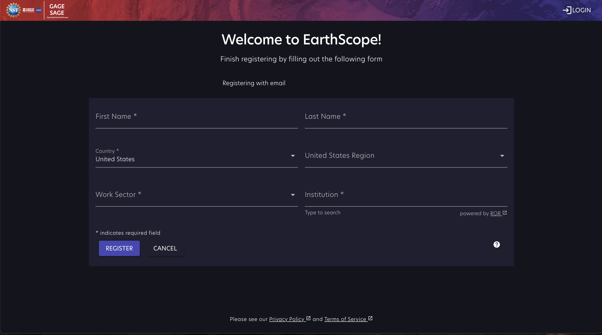

# Register an EarthScope User account

In order to gain access to GeoLab, you will first need to register for an EarthScope User account.

To start the registration process, click the following link - https://earthscope.org/user

And that should bring you to the screen below

At the bottom, you can register a new User account by clicking either "Continue with Google" or "Continue with Cilogon". If you do not have a Google or CiLogon account associated with the email that you will use to register, click on the "Don't have an account? Sign Up" link instead.

Either option you choose will bring up a page that has several required fields to fill out: First Name, Last Name, Country, Work Sector, and Institution.

Our list of institutions is populated by the [Research Organization Registry](https://ror.org/) but if your institution if not included, just type the full name and click on the red 'Save...' button in the box. If you are *not* currently affiliated with a research or education institution, type "none" in this box and then click "Save".

Finally, click "Register" and that should complete the process. You will then be taken to your User homepage at https://www.earthscope.org/user/info where you can see your account details and manage credentials for API access or real-time GNSS licenses.