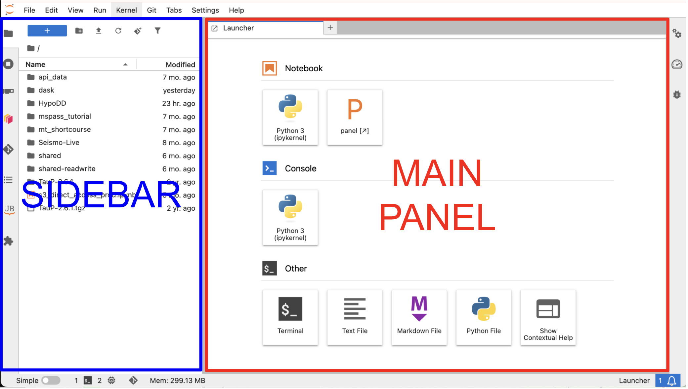
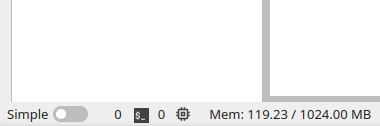

# Navigating GeoLab and its File System

GeoLab is designed to look and feel like a familiar IDE. Here's a quick tour:




## Main Panel:
The Main Panel is home to the Launcher, where you can launch all of GeoLab's connected apps. From here, you can open new python notebooks, terminal consoles, and text/markdown files. 

You can always reach the launcher with the blue + button in the top left, by navigating to File -> New Launcher, or opening a new tab in the main panel. 

## Sidebar
The sidebar contains several tabs that will help you navigate the GeoLab environment and its extensions. Some images may contain extensions that differ from the ones described here. 

###  File Browser:
Your files are connected to your user account and will be loaded each time you log into GeoLab, no matter which server options you select at login.

Individual user storage quotas are in place. You should treat your file system as a place to keep notebooks and _intermediate_ data while actively working on your workflow and analysis. GeoLab is not designed for long term storage of raw data or final data products.

```{note}
The `\shared` and `\shared_readwrite` directories are available to all GeoLab users. <br>
The `\shared` drive is read-only. Look here for materials specific to EarthScope Short Courses / Workshops and tutorials. <br>
The `\shared_readwrite` is accessible to all users. Any data placed here may be viewed, modified, or deleted by other users. Please use this space as a _temporary_ means of sharing with colleagues. Please keep this space organized, clean up after yourself, and use respect and caution in accordance with the [Acceptable Use Policy](../welcome/geolab_AUP.md) and [Code of Conduct](../welcome/geolab_CoC.md)! 
```

At the top of the File Navigation Pane, you'll find shortcuts to:
- create a new folder
- upload files
- refresh the file system navigation pane
- clone a git repository (see [Using Git](./using_git.md))
- filter/search your files

Standard file operations (i.e., rename, delete, copy, paste, etc) are available by right-clicking on a file/folder. 

###  Usage Browser:
The usage browser makes it easy to toggle between all of your active tabs, python kernels, and workspaces. This tab offers a quick way to keep your work organized and manage resources.

###  Dask Dashboard:
Dask is a powerful extension that orchestrates workflow parellilization. This panel allows you to manually configure dask workers and to explore performance metrics. See [Dask](../advanced_topics/dask.md) for more details.

###  Git Dashboard:
Git is a powerful tool for version control, collaboration, and sharing work in accordance with Open Science and Reproducibility values. 
The git dashboard allows manual/visual control of git repositories. 
See [Using Git](./using_git.md) for more details.

###  Table of Contents:
If the python notebook or markdown file in the active tab in the main panel contains headers and subsections, you can navigate to sections of the file using this panel.
When developing notebooks longer than a couple of cells, it is recommended you add section headers and annotate your work to keep your work organized and take advantage of this feature. 

###  JB - JupyterBook Navigation:
If any of the cloned git repositories in your file system contain JupyterBook documentation, it can be navigated here. 

###  JupyterLab Extension Manager:
There are many community-developed extensions for JupyterLab that you may wish to install in GeoLab. These can be managed here. 

## Footer

(resource-monitor)=
### Resource Monitor
Images with the jupyter-resource-usage extension installed allow you to view your resource utilization at the bottom status bar.

