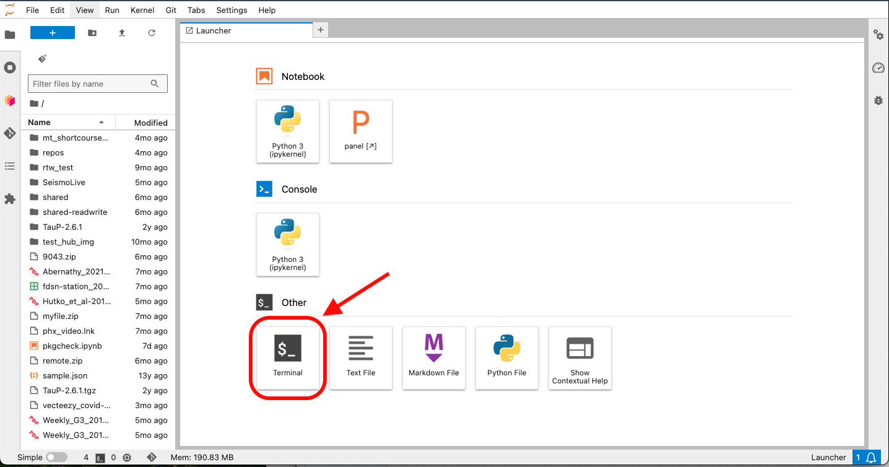
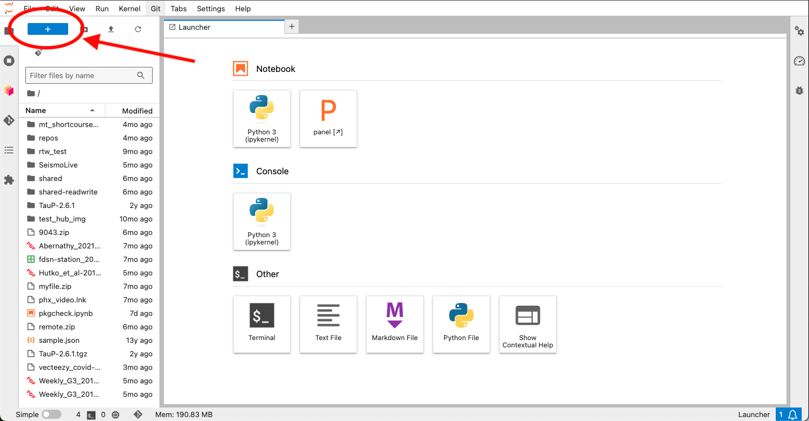

# Using the Terminal in GeoLab

## Familiar `shell`

Users often need to use an interactive shell type to organize files on their home directory, install software not included in the base GeoLab image, clone repositories into their environment using git, or develop a shell-scripting data analysis workflow.

GeoLab provides easy access to the Terminal window to accomplish these tasks.

## How to Open a Terminal

If you want to open Terminal immediately after logging into GeoLab, you can use the `Launcher` window that opens by default in your workspace. A quick link to the Terminal app is provided in the bottom left corner, under the "Other" section. Click on the "Terminal" tile to launch.

If you ever lose the `Launcher` window while working in GeoLab, you can always open a new one by selecting the blue "+" button at the upper left section of the `File Browser` panel.

By default, GeoLab uses the Bourne Again Shell `bash`. When the Terminal is open, you can use the command line as in any other Unix-like Terminal.

## User `jovyan` and Root Privileges

As is [customary with the Jupyter community](https://docs.jupyter.org/en/latest/community/content-community.html#what-is-a-jovyan), the `home` directory path for each user is listed as `/home/jovyan` in the Terminal window. This is a labeling convention; JupyterHub and the GeoLab administrators preserve your unique identity tied to your email or Google/Cilogon profile.

If you are interested in more details about the `jovyan` user and how to use this user ID to develop custom images, see the environment management section.

The `jovyan` user does not have a password as a generic user ID. This means that GeoLab users cannot use the `sudo` command to override system commands.