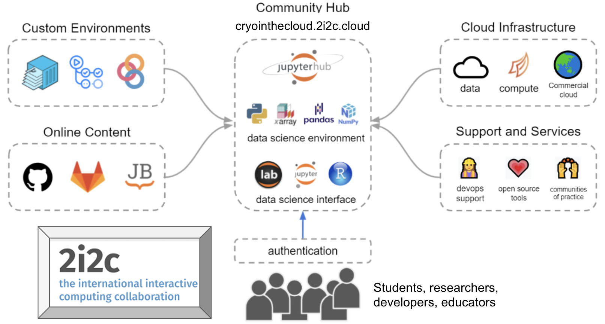

# About GeoLab

## Our Motivation
The nature of scientific discovery and collaboration is changing in ways that continue to astonish and inspire us. The way research is conducted, data are collected, and results communicated to the public and private stakeholders is rapidly evolving. Broadly, we see science trending away from isolated, privileged institutions to distributed networks of communities with individual members that move dynamically from one group to another. With GeoLab, we seek to leverage that new, contemporary structure to make geophysical science more transparent, productive, and repeatable.

One of the key objectives of EarthScope's GeoLab is to demonstrate how cloud infrastructure and services can facilitate high-quality, repeatable geophysical research. We are acutely aware of the barriers individuals may face when transitioning from traditional downloading and managing large amounts of data on their local workstations to a cloud-based workflow. The complexity of deploying and maintaining infrastructure, the uncertainty of cost-control measures, the unfamiliarity with commercial cloud services, and a general lack of awareness of community standards and knowledge all contribute to the hesitancy of adopting cloud technologies for your research goals.

Based on the welcoming, interconnected practices of open-science communities like [Pangeo](https://www.pangeo.io) that have pioneered data-intensive JupyterHub workflows in the cloud, we seek to overcome these barriers by building on existing open-source infrastructure and software to lower the barrier of entry for researchers looking to move their workflows into the cloud.

## What is GeoLab?

GeoLab is a JupyterHub operated by EarthScope Consortium deployed on Amazon Web Services (AWS) and managed by the [International Interactive Computing Collaboration (2i2c)](https://www.2i2c.org).

GeoLab provides customizable, cloud-based computing environments for geophysical researchers and educators to analyze and visualize data. Creating identical computing environments is straightforward, ensuring that software versions are consistent across all users. Since GeoLab operates in the cloud, anyone with a reliable internet connection can use it.

One of GeoLab's primary benefits is that it runs adjacent to the NSF GAGE and SAGE [Data Repositories](https://www.earthscope.org/data/) in AWS (us-east2). Users can now leverage low-latency, high-throughput access methods to analyze large volumes of data.

GeoLab was designed to analyze geodetic and seismological data, but it is not limited to these domains. Any research group looking to work with large geophysical datasets or those that prefer not to maintain a complex computing environment could benefit from working in GeoLab.

### Hub Management

The GeoLab platform is built and maintained by [2i2c](https://2i2c.org). This non-profit organization excels in using open-source tools to design and operate JupyterHubs for other institutions supporting research and education. An illustration of their community service model, which brings a community of users together into a shared computing instance focused on cutting-edge data science, is shown below.

With their [Right to Replicate](https://2i2c.org/right-to-replicate/) policy, 2i2c ensures that GeoLab remains flexible concerning commercial cloud providers and avoids the potential for vendor lock-in.

EarthScope and 2i2c collaborate to develop resources that enable research and education communities to leverage cloud computing, data-intensive processing without data transfer, repeatable analysis, and more.

### Help
GeoLab is a growing platform and community. We value your questions and feedback.

Please reach us at data-help@earthscope.org if you need assistance.

We welcome your thoughts on GeoLab's future. Please fill out our [Community Feedback Form](geolab_feedback_form).