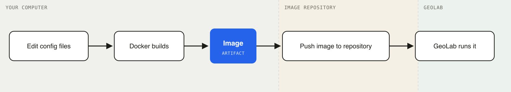

# Building Custom GeoLab Images

A GeoLab image is a complete, prepackaged computing environment that runs in JupyterLab, bundling common geophysics Python and scientific packages together. Starting a GeoLab session launches an image. This guide walks through building an image with a customized environment, using Docker and git.

Steps:

- [How It Works](#how-it-works)
- [Before Starting](#before-starting)
- [Step 1: Get the Template](#step-1-get-the-template)
- [Step 2: Add Your Packages](#step-2-add-your-packages)
  - [environment.yml: Your Main Package List](#environmentyml-your-main-package-list)
  - [requirements.txt: Packages Only on PyPI](#requirementstxt-packages-only-on-pypi)
  - [apt.txt: System Software (Rarely Needed)](#apttxt-system-software-rarely-needed)
  - [postBuild: One-Time Setup Commands](#postbuild-one-time-setup-commands)
- [Step 3: Build and Test Locally](#step-3-build-and-test-locally)
  - [Verifying the installed packages](#verifying-the-installed-packages)
- [Step 4: Publish Your Image](#step-4-publish-your-image)
  - [Rebuild for GeoLab's platform](#rebuild-for-geolabs-platform)
  - [Push the image](#push-the-image)
  - [Publishing to GitHub or AWS Image Repositories](#publishing-to-github-or-aws-image-repositories)
- [Step 5: Launch It in GeoLab](#step-5-launch-it-in-geolab)
- [Making Changes Later](#making-changes-later)
- [Troubleshooting Package Installation](#troubleshooting-package-installation)
- [Quick Reference](#quick-reference)
- [Getting a Personal Access Token (for GHCR)](#getting-a-personal-access-token-for-ghcr)

> [!NOTE]
> These instructions are written for macOS, Linux and similar systems. While the same steps can be executed on Windows the details will vary.

---

## How It Works

Think of an **image** as a recipe, with each Python package as an ingredient. Building the image is cooking the meal from the recipe. A **container** is that meal served on a plate. The recipe doesn't change and you can make the same meal over and over, GeoLab does the same thing, launching a fresh container from your image every time.

The `geolab-base` template (used in the steps below) is based on a Pangeo image (`pangeo/base-image`) as its starting point; a custom image is created by modifying the build on top of it.

Install Python packages in an image by editing plaintext files that list the required software. `Docker` reads those files and builds the image. The image must then be published in an image repository so GeoLab can access it:



---

## Before Starting

Two pieces of software must be installed on **your computer**:

1. **Docker Desktop.** Download it at [docker.com](https://www.docker.com/products/docker-desktop/), install it, and leave it running in the background.

   > [!TIP]
   > If you're new to Docker, images, and containers, work through the [getting-started modules](https://docs.docker.com/get-started/introduction/#modules) to learn how to build, run, and publish images. Alternatively, Docker Engine (with build plugins) can be used instead of Docker Desktop; this is what is often installed on Linux systems.

   After starting Docker Desktop, log into Docker, creating an account if needed. This is what enables pushing (publishing) an image to Docker Hub, Docker's image repository, so it's available to others (and to GeoLab itself).

2. **Git client**, to download the GeoLab Dockerfile template. Use the operating system's package manager to install one, or follow the [instructions](https://github.com/git-guides/install-git) to check for and install git if needed.

Verify Docker and git are installed and working by opening a terminal and running:

```
docker --version
git --version
```

If they print a version number, they are installed and working.

In addition to the required software, a **GitHub** account at [github.com](https://github.com), a Docker account, or an AWS account is needed for publishing the image and making it available to GeoLab.

---

## Step 1: Get the Template

EarthScope provides a starter template. Download it using git to set up a working folder:

```shell
git clone --depth 1 https://github.com/EarthScope/GeoLab.git
cp -R GeoLab/geolab-base my-geolab-image
cd my-geolab-image
```

The `my-geolab-image` folder contains these files:

```
my-geolab-image/
├── Dockerfile          ← do not edit this
├── environment.yml     ← add your conda packages here
├── requirements.txt    ← add PyPI-only packages here
├── apt.txt             ← add system software here (rarely needed)
├── start               ← do not edit this
├── test_helpers.py     ← Python module with testing functions for packages
└── test_notebook.ipynb ← interactive version of the smoke test
```

> [!NOTE]
> The only files to edit are `environment.yml`, `requirements.txt`, and `apt.txt` (plus an optional `postBuild` script, covered below). Everything else is set up for you.

> [!TIP]
> For image development it is recommended to keep your files in a git repository to track changes, share with others, etc. The sooner this is started the better, this is the right stage to commit these starting files to a new repo.

---

## Step 2: Add Your Packages

### environment.yml: Your Main Package List

Add conda Python packages from `conda-forge` here. Open the file and add packages under the `dependencies` section:

```yaml
channels:
  - conda-forge
  - nodefaults
dependencies:
  - python=3.12
  # --- Geophysics ---
  - obspy
  - pygmt
  # --- Geospatial ---
  - cartopy
  - geopandas
  # add your packages below:
  - my-package-name
```

Conda packages are preferred, because conda checks that everything works together before installing and reduces the possibility of dependency conflicts among packages.

### requirements.txt: Packages Only on PyPI

Some packages aren't available through conda-forge and must be installed from PyPI. Add them here, one per line. You can pin a specific version with `==` to ensure reproducibility:

```
earthscope-sdk==1.4.1
seisbench
```

> [!TIP]
> Pin versions for packages critical to your workflow (e.g., `earthscope-sdk==1.4.1`). This prevents silent breakage from upstream releases if you rebuild the image later.

### apt.txt: System Software (Rarely Needed)

Most scientific packages go in `environment.yml`. Only use `apt.txt` for low-level system tools that can't be installed any other way:

```
build-essential
git
```

> [!TIP]
> Only add packages here that aren't available through conda. Most scientific Python libraries are better managed in `environment.yml`.

### postBuild: One-Time Setup Commands

A `postBuild` script (create the file if you need one) runs automatically after all packages are installed. Use it for one-time setup steps that can't be expressed as package installs, for example, configuring tools, downloading data files, or logging build metadata.

**Example:** Create a `postBuild` file to record the build timestamp:

```shell
#!/bin/bash
set -euo pipefail  # fail fast: on command error, unset variable, or any pipeline stage failing

echo "--- Running post-build commands ---"

# Record when this image was built
date > ${CONDA_DIR}/etc/build_timestamp

echo "Build stage completed successfully."
```

---

## Step 3: Build and Test Locally

Building and testing the image locally is the fastest way to iterate on changes and fix issues. Services that are only available in GeoLab, such as direct access to repositories in S3 storage, cannot be tested locally.

**Build the image:**

```shell
docker build -f Dockerfile --tag my-geolab-image:0.1.0 .
```

This reads the config files and assembles the image; it can take several minutes the first time. You may omit the `:0.1.0` part of the tag if you wish.

> [!TIP]
> Do not publish and try to run this image in GeoLab, it may not be the correct platform. See [Step 4](#step-4-publish-your-image) for building the platform image.

**Run it locally:**

```shell
docker run --rm -p 8888:8888 my-geolab-image:0.1.0
```

The `--rm` flag deletes the container created from the image after the run completes, keeping repeated commands from piling up containers. The `-p 8888:8888` option maps the container's network port so your computer can reach it.

Look in the output for a line like `http://127.0.0.1:8888/lab?token=...` and copy that URL into a browser, a JupyterLab session will open.

> [!TIP]
> This image is not running in the GeoLab platform, so any features only available in GeoLab will not work from this local environment.

### Verifying the installed packages

The image includes `test_notebook.ipynb`, which ensures installed packages import and run. It is copied into the container at build time, so it is available in the running container. Use it after a build to confirm nothing is broken (a missing system library or version conflict often installs cleanly but fails at import). Adjust it as needed for the packages that you added or removed from the build.

The notebook's checks are built on top of `test_helpers.py`, a small module of test helpers (also copied into the container) that the notebook imports rather than duplicating this logic in every cell:

| Function | Use for | What it does |
| --- | --- | --- |
| `py(modname, alias=None, smoke=None)` | Python packages | Imports `modname` and, if given, calls `smoke(mod)` as a minimal sanity check (e.g. constructing an object or calling a function). Records a pass with the package's `__version__`, or a fail with the exception. |
| `cli(cmd, version_flag='--version')` | Command-line tools | Confirms `cmd` is on `$PATH` and responds to `version_flag`. Records a pass with the version string, or a fail if it's missing. |

Each call appends a `(name, status, version, error)` row to the shared `RESULTS` list, which the notebook's final cell renders as a summary table.

In the JupyterLab session at `http://127.0.0.1:8888/lab...`, open `test_notebook.ipynb` and run all cells (Run → Run All Cells). The notebook is organized into one section per category in `environment.yml`/`requirements.txt` (Cloud & storage, Geospatial, Core scientific stack, etc.), each running `py()`/`cli()` checks for the packages in that category, and ends with a summary table listing the status (and version) of each package, with failures highlighted in red.

**Adding a test for a new package.** If you add a package to `environment.yml` or `requirements.txt`, add a matching check to `test_notebook.ipynb` so it's covered by the summary table. Pick the section that matches where you added the package (or add a new section), and add a `py()` or `cli()` call.

For example, adding `seisfetch` (a Python package) to the Geo / geoscience section:

```python
py('dascore')
cli('gmt', version_flag='--version')
py('obspy',
   smoke=lambda m: m.UTCDateTime('2020-01-01').timestamp)
py('obsplus')
py('pygmt')
py('seisfetch',
   smoke=lambda m: m.Client())  # replace with a minimal, side-effect-free call
```

The `smoke` argument is optional but recommended, a bare import can succeed even when the package is broken in ways that only show up on first use (e.g. a missing compiled extension). Pick a call that exercises the package without hitting the network or requiring credentials, since the notebook may run without EarthScope services available locally.

> [!TIP]
> A failure here points at the package, not your notebook code, usually a missing system dependency (add it to `apt.txt`) or a version conflict between conda and pip packages. If something fails, it usually means a package name is misspelled or a version is unavailable, so go back to `environment.yml` or `requirements.txt`, fix it, and rebuild.

---

## Step 4: Publish Your Image

Once your configuration files are ready and the local test passes, rebuild the image *for the GeoLab platform* and push it to a container registry so GeoLab can access it.

### Rebuild for GeoLab's platform

GeoLab runs on Linux (`linux/amd64`). Depending on your computer's architecture (e.g. Apple Silicon), you may need to rebuild the image for that platform. Name the image using your repository username, a descriptive name, and a tag to track versions, such as `username/my-geolab-image:0.1.0`.

```shell
docker build --no-cache -f Dockerfile \
 --platform linux/amd64 \
 --build-arg IMAGE_TITLE=my-geolab-image \
 --build-arg IMAGE_AUTHORS=you@university.edu \
 --tag username/my-geolab-image:0.1.0 .
```

> [!TIP]
> Setting a version in the image tag is a best practice, it lets you track changes and reproduce a specific build later. Record what changed for each version in a `CHANGELOG.md` file. Without an explicit tag, Docker defaults to tagging the image `latest`, which makes it hard to tell which build is actually running.

Replace `username` with your Docker Hub username (or your registry path), `my-geolab-image` with your image name, and `0.1.0` with your version tag. The `--build-arg` values for `IMAGE_TITLE` and `IMAGE_AUTHORS` are optional but recommended for image metadata.

> [!NOTE]
> **Why `--platform linux/amd64`?** GeoLab runs on Linux. If you're on a Mac with Apple Silicon, your local machine uses a different architecture, this flag ensures the image works on GeoLab regardless of what you built it on.

`--no-cache` forces Docker to rerun build steps from scratch, ensuring a clean build when publishing.

### Push the image

If you created an account using Docker Desktop, pushing to Docker Hub does not require additional authentication:

```shell
docker push username/my-geolab-image:0.1.0
```

Replace the details to match the `--tag` value in the build command. By default, images published to Docker Hub are public and available for use with GeoLab.

> [!TIP]
> If the push results in an error, make sure you are logged into Docker Hub using `docker login`.

Many other image repositories exist. If you use AWS ECR, follow these [instructions](https://docs.aws.amazon.com/AmazonECR/latest/userguide/docker-push-ecr-image.html).

### Publishing to GitHub or AWS Image Repositories

Alternatives to Docker Hub include GitHub Container Registry (ghcr) or AWS Elastic Container Registry (ECR). Choosing an image repository depends on your requirements. GitHub features tight integration with CI (Continuous Integration) through GitHub Actions that can trigger an image build and push to ghcr, automating the process through a `pull request`. AWS ECR offers cloud-scale uploads and downloads to support multiple instances of GeoLab requested by hundreds of users or more.

Both ghcr and ECR have more stringent authorization practices and controls over publicly available images. For a step-by-step walkthrough for pushing images to either repository, go to [Pushing Images to GitHub or AWS ECR](https://docs.earthscope.org/geolab/advanced-topics/environments/pushing-to-ghcr-ecr) for detailed instructions.

---

## Step 5: Launch It in GeoLab

1. Go to [earthscope.org/data/geolab](https://www.earthscope.org/data/geolab/) and click **Launch GeoLab**.
2. Log in with your [EarthScope account](https://www.earthscope.org/user/login).
3. If a **Stop My Server** button appears, click it first.
4. Click **Start My Server**.
5. Under **Environment**, choose **Other**.
6. In the **Custom image** field, enter the image name from your registry, e.g. `ghcr.io/your-github-username/my-geolab-image:0.1.0` or `username/my-geolab-image:0.1.0` (for Docker Hub). If the image is not in Docker Hub, use the full image reference.
7. Click **Start**.

GeoLab will pull your image and launch a session from it. The first launch takes a bit longer while it downloads; after that it's cached and starts quickly.

---

## Making Changes Later

Edit your config files, then rebuild and push with a new version number:

```shell
docker build --no-cache -f Dockerfile \
  --platform linux/amd64 \
  --tag ghcr.io/your-github-username/my-geolab-image:0.1.1 .

docker push ghcr.io/your-github-username/my-geolab-image:0.1.1
```

> [!TIP]
> Always use a new version number (`0.1.1`, `0.1.2`, etc.) when you rebuild. Images are cached by different systems, including the image repository and GeoLab, if you reuse the same tag, GeoLab may load the old cached version instead of your new one.

---

## Troubleshooting Package Installation

In general, it's best practice to install packages using the conda package manager for the GeoLab image. Conda checks packages for dependencies, which helps ensure that conflicts are resolved in the environment. Conda has a search function to discover packages.

Some packages are only available on PyPI and are installed with the pip package manager, which also has a search function.

> [!TIP]
> Keep in mind that installation name and import name can be different (for example, `scikit-learn` vs `sklearn`).

**Find if a conda package is available:**

```shell
conda search -c conda-forge #PackageName (e.g., seisbench)
```

**Find if a package is available on PyPI:**

```shell
python -m pip index versions #PackageName (e.g., seisbench)
```

---

## Quick Reference

| What you want to do | Where to do it |
|---|---|
| Add a Python package | `environment.yml` under `dependencies` |
| Add a PyPI-only package | `requirements.txt` |
| Add a system tool | `apt.txt` |
| Run one-time setup commands | `postBuild` (create if needed) |
| Build locally for testing | `docker build --tag my-geolab-image:0.1.0 .` |
| Run locally | `docker run --rm -p 8888:8888 my-geolab-image:0.1.0` |
| Test packages | Run `test_notebook.ipynb` (see [Step 3](#step-3-build-and-test-locally)) |
| Build for GeoLab | `docker build --no-cache --platform linux/amd64 --tag username/image:version .` |
| Publish | `docker push username/my-geolab-image:0.1.0` |

---

## Getting a Personal Access Token (for GHCR)

Before you can push images to GHCR, you need a **Personal Access Token (PAT)** with package permissions:

1. Go to **GitHub → Settings → Developer settings → Personal access tokens → Tokens (classic)**.
2. Click **Generate new token (classic)**.
3. Give it a name (e.g. `geolab-image`), set an expiration, and check the **`write:packages`** scope.
4. Click **Generate token** and copy it, as you won't be able to see it again.

Save your token somewhere safe (a password manager works well). You'll use it to log in to the registry when publishing.
