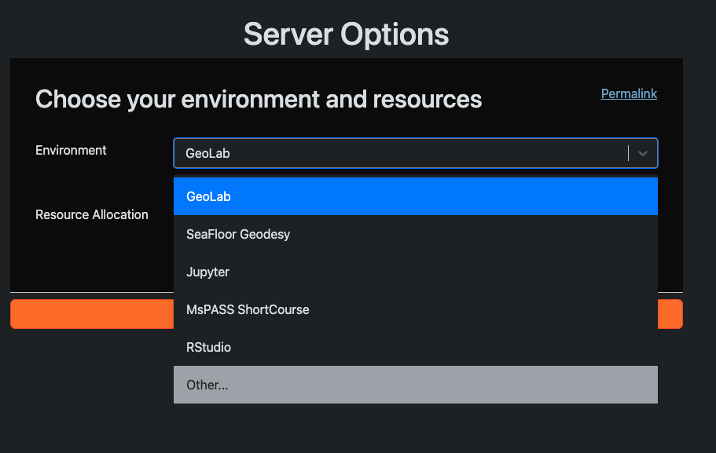
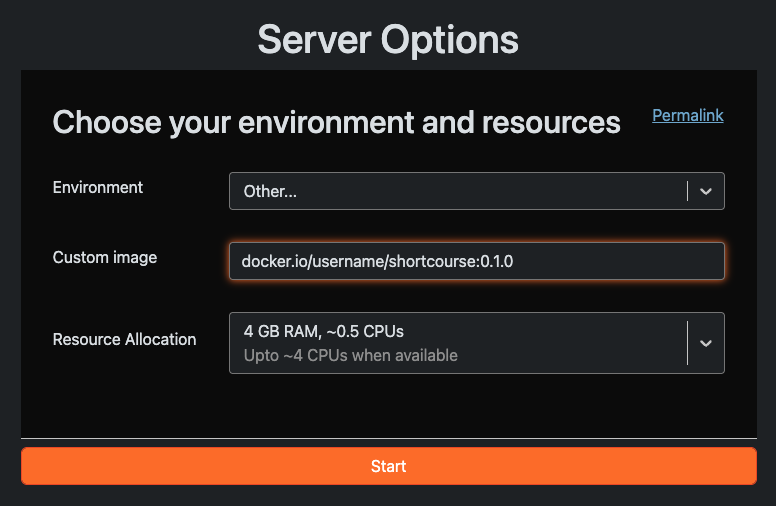

# Building Custom GeoLab Images

GeoLab environments run inside **Docker containers** — self-contained packages that bundle an operating system, software libraries, and Python packages together. This guide walks you through customizing a GeoLab image by editing a few plain-text configuration files, then building and deploying the result.

> **What is a Docker image?** Think of it as a snapshot of a complete computing environment. When GeoLab launches, it starts a container from that image — like booting from a pre-configured disk.

GeoLab uses `pangeo/base-notebook` as its starting point. You customize it by editing four files before building:

| File | What it controls |
|------|-----------------|
| `apt.txt` | System-level software (installed via `apt`) |
| `environment.yml` | Conda packages and channels |
| `requirements.txt` | Python packages from PyPI (installed via `pip`) |
| `postBuild` | Commands to run after the build completes |
| `start.sh` | The command that launches when the container starts |

---

## Installing System Software with apt

`apt` is the Ubuntu package manager — it installs system-level tools like compilers, runtime libraries, and command-line utilities. Add any packages you need, one per line, to `apt.txt`.

**Example:** Adding Node.js and npm:

```txt
git
build-essential
gfortran
make
gmt-dcw
gmt-gshhg
nodejs
npm
```

> **Tip:** Only add packages here that aren't available through conda. Most scientific Python libraries are better managed in `environment.yml`.

---

## Installing Conda Packages

Conda manages Python (and non-Python) packages within isolated environments. Edit `environment.yml` to add packages by name under the appropriate section. Always use the `conda-forge` channel for the broadest package availability.

**Example:** Adding ObsPy Plus (`obsplus`) to the Geophysics section:

```yml
channels:
  - conda-forge
dependencies:
  ...
  # ── Geophysics ──────────────────────────────────────
  - dascore
  - gmt
  - obspy
  - pygmt
  - obsplus
  ...
```

> **Tip:** Prefer conda packages over pip when a package is available in both. Conda resolves environment-wide dependencies more reliably.

---

## Installing pip Packages

Some packages are only available on PyPI (Python's package index) and must be installed with `pip`. Add them to `requirements.txt`, one per line. You can pin a specific version with `==` to ensure reproducibility.

**Example:** Adding `gnss-lib-py`:

```txt
# --- EarthScope ---
earthscope-sdk==1.4.1
earthscope-cli==1.2.0
earthscopestraintools
gnssrefl
hypoinvpy
gnss-lib-py
```

> **Tip:** Pin versions for packages critical to your workflow (e.g., `earthscope-sdk==1.4.1`). This prevents silent breakage when upstream packages release updates.

---

## Running a postBuild Script

The `postBuild` script runs automatically after all packages are installed. Use it for one-time setup steps that can't be expressed as package installs — for example, configuring tools, downloading data files, or logging build metadata.

**Example:** Recording the build timestamp:

```bash
#!/bin/bash
echo "--- Running post-build triggers ---"

# Record when this image was built
date > /etc/build_timestamp
echo "Build stage completed successfully."
```

Make sure the script is executable before building:

```bash
chmod +x postBuild
```

---

## Start Script

`start.sh` runs when a user launches a container. Its job is to start the main process — typically JupyterLab. The `--notebook-dir` parameter sets the default working directory shown in JupyterLab's file browser.

**Example:** Starting JupyterLab at a specific directory:

```bash
#!/bin/sh
# Exit immediately if any command fails
set -e

jupyter lab --ip=0.0.0.0 --no-browser --notebook-dir=/path/to/your/work
```

---

## Building and Pushing the Image

Once your configuration files are ready, you build the image locally and push it to a container registry so GeoLab can access it.

**Step 1 — Build the image**

The `--platform linux/amd64` flag ensures the image runs on standard cloud hardware regardless of whether you're building on an Apple Silicon Mac or an Intel machine. The Dockerfile wires together your four config files. Name the image using your repository username, a descriptive name and tag to track versions, such as username/shortcourse:0.1.0

```bash
docker build --no-cache -f Dockerfile \
  --platform linux/amd64 \
  -t username/shortcourse:0.1.0 .
```

Replace `username` with your Docker Hub username (or your registry path) and `0.1.0` with your version tag.

> **What does `--no-cache` do?** It forces Docker to re-run every build step from scratch, ensuring your latest `apt.txt`, `environment.yml`, and `requirements.txt` changes are picked up rather than reused from a previous build.

**Step 2 — Push to a registry**

Push the finished image to Docker Hub, AWS ECR, or another registry so GeoLab can pull it:

```bash
docker push username/shortcourse:0.1.0
```

> **First time?** You'll need to log in first with `docker login` (Docker Hub) or the appropriate CLI for your registry.

---

## Running Your Image in GeoLab

1. Open GeoLab.
2. Choose **Environment → Other**.

   

3. Enter the full image name from your registry, e.g.:

  **docker.io/username/shortcourse:0.1.0**

   

4. Select **Start**.

GeoLab will pull and launch your custom environment. The first launch may take a minute while the image downloads.
